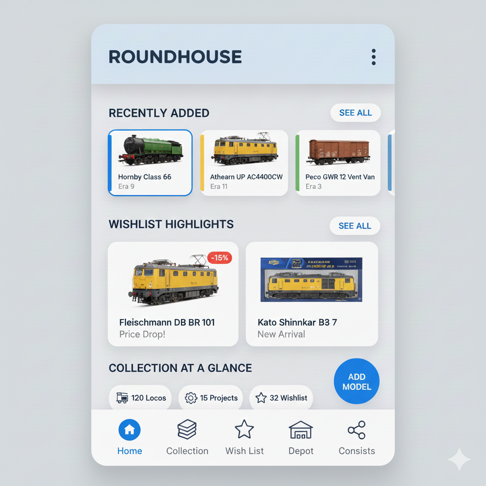
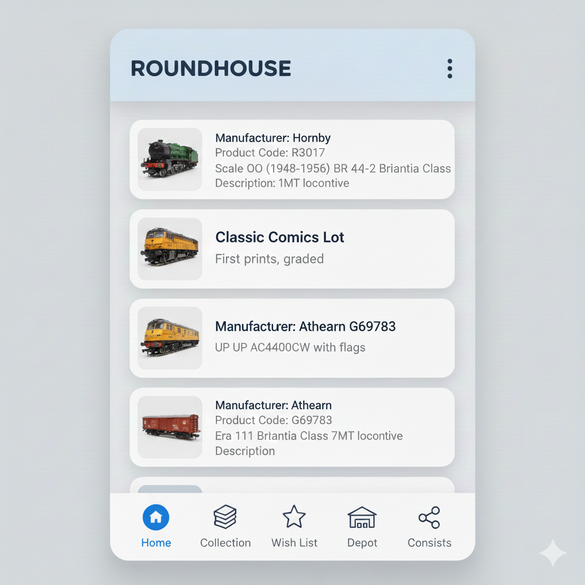

# 04 — User Experience Requirements

## Layout

### Hierarchy and Navigation

The app follows a top-down hierarchy designed for quick status checks and easy switching between hobbyist tasks.
- _The Header (Top Bar)_: Serves as the primary anchor. By using a `CenterAlignedTopAppBar`, the "Roundhouse" branding is prominent, signaling to the user exactly where they are. The three-dot menu (overflow) keeps secondary actions (like _Settings_ or _Exporting data_) out of the primary view to reduce clutter.
- _The Bottom Navigation_: This is the "Engine Room" of the app. It uses the Material 3 standard of 5 destinations, providing thumb-friendly access to core features. The _Home_ icon is the landing point, while _Depot_ (likely for storage/inventory management) and _Consists_ (for train formations) are specialized tools for the power user. 

### Information Architecture (The Cards)
The core of the UX is the Railway Model Card. Since model railroading is a detail-oriented hobby, the cards are designed for high scannability:
- _Visual Recognition_: A square thumbnail on the left allows collectors to instantly recognize the locomotive or rolling stock by its livery or silhouette.
- _Data Density_: Instead of just a title, the card uses a "metadata-first" approach.
  * Primary Text: The Product Name (e.g., "Class 66 Diesel").
  * Secondary Text: A structured string (Manufacturer | Product Code | Scale | Era). This allows a user to scroll through a long list and find a specific "N Scale" item or "Era 4" wagon without opening every single entry.
- _Tactile Feedback_: Each card acts as a "container." Tapping it would typically trigger a "Container Transform" animation (a Material 3 staple) that expands the card into a full-screen detail view.

### Interaction Design
- _Scrolling_: As the user scrolls through their collection, the Top App Bar can "lift" (adding a slight shadow or color tint) to show that the content is moving beneath it, providing a sense of depth.
- _Navigation_ Transitions: Moving between "Home" and "Wish list" would use a smooth horizontal fade-through, making the app feel fast and responsive.
- _Empty States_: If the "Depot" or "Wish list" is empty, the UX would likely show a friendly illustration of an empty track with a clear "Add Model" Floating Action Button (FAB).

Summary Table: User Goals

| User Goal        | UX Feature                                                      |
|------------------|-----------------------------------------------------------------|
| Identification   | Clear photo + Manufacturer/Product Code on card.                |
| Efficiency       | Bottom Navigation for one-tap switching between lists.          |
| Scalability      | LazyColumn (scrolling list) to handle hundreds of models.       |
| Branding         | Bold, centered "Roundhouse" header for a premium hobbyist feel. |

## Home screen

To avoid clutter while keeping the Roundhouse home screen useful, you should move away from a single long list and instead use a "Dashboard" approach.
In Material 3, this is best achieved using horizontal carousels and contextual sections. This allows the user to see a high-level overview of different categories (Recently Added, Wishlist, etc.) without having to scroll endlessly through a single vertical list.

### The "Dashboard" Layout Strategy

Instead of showing every detail for every item, use the home screen as a "Launchpad."
- _Stats Overview_: A small, elegant row of "Chips" or "Badges" showing total counts (e.g., "120 Locos," "15 Projects").
- _Recent Activity Section_: A horizontal row of small cards showing the last 3-5 items added to the collection.
- _Wishlist Highlights_: A section showing items that have recently dropped in price or were just added to the wishlist.
- _Quick Actions_: A Floating Action Button (FAB) for "Add New Model" so the most common task is always one thumb-press away.

### Suggested Home Screen Hierarchy

| Section           | Content Type       | UI Component                        |
|-------------------|--------------------|-------------------------------------|
| Header            | App Name & Profile | CenterAlignedTopAppBar              |
| Activity Feed     | "Just Added"       | Horizontal Scroll Row (Small Cards) |
| Maintenance/Depot | "Needs Service"    | List Item (Standard Card)           |
| Wishlist          | "Priority Items"   | Grid (2x2 Compact Cards)            |

### UX Design Principles for "Roundhouse"

- Progressive Disclosure: Show only the Model Name and Photo on the Home Screen. Reveal the Manufacturer, Era, and Product Code only when the user taps into the detail view or expands the card.
- Visual Grouping: Use "Sub-headings" (e.g., "Recently Added") with a "See All" text button next to them. This gives the user control over how much they want to see.
- Color Coding by Era: Subtly use color on the edge of the cards to represent different Eras (e.g., Blue for Era IV, Green for Era III). This helps the user categorize items visually without reading text.

## Responsive behavior

The app uses three breakpoints to adapt its UI:

- Compact: narrow screens (small phones)
  * Navigation: bottom navigation bar only
  * Header: reduced title size
  * Content: compact typography and tighter spacings
  * Start screen: Home (shows a temporary "Welcome Home" placeholder)

- Medium: tablets and small desktops
  * Navigation: bottom navigation bar only
  * Header: medium-sized title
  * Content: slightly larger typography than compact

- Large: wide desktops and large windows
  * Navigation: persistent left menu (permanent drawer) and the content area on the right
  * Header: regular title size

## Typography adjustments

- To keep content readable and well-fitted on small screens the app reduces typography on compact and medium layouts:
  - Compact: smaller title and small navigation labels; primary content uses a compact body style.
  - Medium: slightly larger title than compact but still smaller than large layouts; navigation labels remain compact.
- Large screens use the normal app typography for titles and content.

## Interaction principles

- Keyboard and mouse fully supported on desktop
- Touch-friendly interactions on mobile devices
- Accessibility: icons include content descriptions and text controls use semantic labels
- Responsive UI adapting between narrow and wide screens

## QA / verification notes

(Short, developer-facing checklist useful for manual QA)

- Verify start behaviour: on app launch, the screen shows the Home placeholder "Welcome Home".
- Compact / Medium: there is no drawer or menu; only the bottom navigation bar should be visible.
- Large: a persistent left menu (drawer) must be visible and contain the listed sections.
- Navigation test tags (useful for automated/manual tests):
  - Bottom navigation items: `nav_my_home`, `nav_my_collection`, `nav_my_wishlists`, `nav_my_depot`, `nav_my_favourites`
  - Large menu home item: `menu_home` (menu items for other sections keep their existing tags like `menu_collection`)
- Accessibility: icons should expose their content descriptions via the app's string resources.

